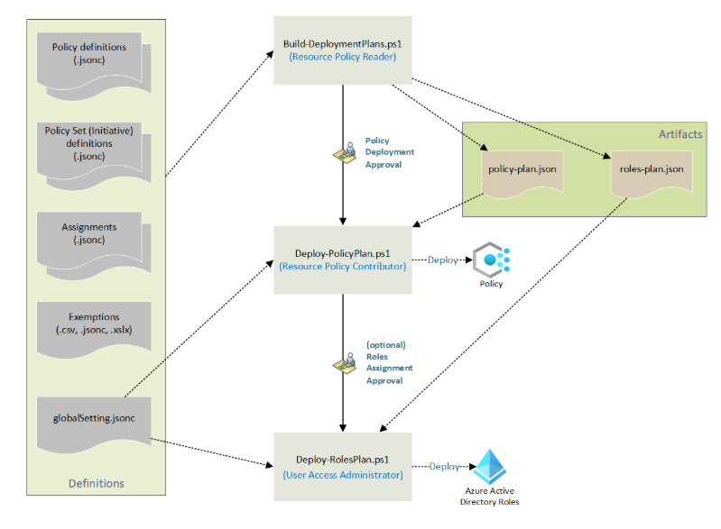

# Azure Policy

This repository contains Azure Policy definations and assignments.

## Azure built in policies & initiatives

[Azure Governance Policy Documentation](https://learn.microsoft.com/en-us/azure/governance/policy/)

## Repository Files Structure

azure-policy/
│
├── policies/                   # Root folder for policy resources.
│   └── policy/
│       ├── policy.json         # Policy Defination.
        ├── parameters.json     # Policy defination of parameters.
│       └── rules.json          # Policy rule.
│
├── assignments/
│   |── policy1assign.json      # Assign for the policy.
    └── exemption.json          # Exemption for assignment.
│
└── workflows/
    └── deploy-policy.yml

## Workflow

## schema

<https://azure.github.io/enterprise-azure-policy-as-code/#who-should-use-epac>
